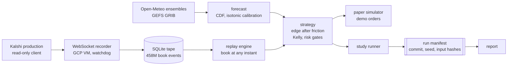

# Kalshi Weather

[](https://github.com/Eucalyptus5/Kalshiweather/actions/workflows/tests.yml)

A systematic trading system for Kalshi's daily high and low temperature markets, and the research program that measured whether it made money. It did not, and establishing that to a publishable standard is what the repository is.

Four months, 337 commits, one developer. The first half is a working forecast-driven trader: ensemble weather forecasts priced across strike ladders, calibrated against realised settlements, sized by fractional Kelly, gated on risk, routed to a depth-aware simulator and the demo exchange. The second half is the apparatus that tested it: a WebSocket recorder holding 458 million order-book events, a deterministic replay engine, and five hypotheses pre-registered against a fixed alpha budget with frozen discovery and holdout splits.

All five resolved. Two reached statistical significance and neither implies a strategy, for reasons given below.

**Stack.** Python 3.12, asyncio, SQLAlchemy and Alembic on SQLite, httpx, websockets, pydantic, NumPy, SciPy, pandas, scikit-learn, PyArrow, cfgrib for GRIB decoding, and `properscoring` and `scoringrules` for scoring rules. Deployed on a GCP VM under systemd. Roughly 35,000 lines across 167 modules in `bot/` and `scripts/`, against 160 test files and 4,881 tests that must be green before any commit.

> Paper and demo only. No live orders and no real capital at any point. There is no code path to a live order.

## Architecture



Studies never read the live venue. Every result in the table below is reproducible from the recorded tape alone.

## The trader

Open-Meteo ensembles feed an `EnsembleCDF` evaluated across a market's strike ladder, so every bracket in an event gets a probability that sums to one across the ladder. Ticker parsing recovers ladder geometry from the ticker alone, including the `T`-infix roots, the above and below tail brackets, and the legacy no-infix series that close a minute earlier than the rest.

Raw model probabilities are not trusted. An isotonic calibration refits nightly against settled outcomes, keyed on strategy, price bucket and lead time, so the number the sizer sees is a calibrated probability rather than a model output. Entry requires edge after friction, where the floor is the taker fee at the fill price plus a half-tick plus a piecewise adverse-selection term, rather than a flat threshold. Sizing is fractional Kelly with shrinkage on the ensemble spread. Risk gates cap exposure per market, per event, per series, as a bankroll fraction, and in aggregate.

Orders route to a depth-aware paper simulator, or under `MODE=demo` to real orders against `demo-api.kalshi.co`. State lives in SQLite under Alembic from the first migration. A reconciliation loop pulls official daily extremes from ACIS and books settlement against every open paper trade.

Market data reads moved to authenticated production in June, behind a separate read-only client that exposes only listings and order books. The demo client keeps every write and portfolio call, and the order path rejects a production client outright. Demo books carry about three percent of production's price levels and move on a small fraction of polls, so a simulator filling against them lands at prices the real venue never quoted.

## The measurement program

The trader's backtest over fifteen months of tape lost to the market's own last print in every scored cell. That turned the project into a measurement problem, and the rest of the repo is the apparatus for answering it honestly.

**Recording.** A WebSocket recorder runs continuously on a GCP VM, capturing book deltas and trades across 20 stations into SQLite, with a stdlib-only health watchdog on a systemd timer and push alerting. The tape holds 458 million book events and has run continuously since 2026-07-17, with a single seven-minute planned gap at a full host migration across cloud projects.

**Replay.** A replay engine reconstructs the book at any instant from recorded deltas and serves it to the strategy code unmodified, so a study and the live bot see the same interface. Candidate fills are drawn from the reconstructed book rather than from an assumed fill rate.

**Provenance.** Each run writes a manifest before any statistic touches the data, recording the git commit, a dirty flag, the bootstrap seed, and a SHA-256 of every input including the pre-registration itself. A missing pre-registration file aborts the run rather than defaulting. Fields that cannot be filled abort the run unless the pre-registration opened a named exemption. Seeds are recorded and never reused across runs that share evidence. The enforcement is in `bot/lag/run_manifest.py`.

**Forecasts.** Open-Meteo ensembles and the statistical guidance product, with GRIB decoding for model backtests; the fifteen-month forecast corpus was built from 33 GB of streamed and discarded GRIB. All prices and fees are `Decimal`, never float.

**Blind windows.** Recorder resubscribes drop roughly ten seconds of book each. Candidate fills landing in a gap, a quiet band, or a resubscribe are excluded and reported as a share of the funnel rather than assumed away.

## Results

| Family | Verdict | Measured | Why it does not trade |
| --- | --- | --- | --- |
| Maker-side economics | **PASS** | +0.20c / +0.28c | Holds only while weather pays no maker fee |
| Settlement source | **PASS** | +33.5c / +39.7c | Entry instant is not identifiable in real time |
| Forecast source | **CLOSED** | -1.18c / -1.85c | Negative at full power over 15 months |
| Low-temp staleness | **UNDERPOWERED** | 5 of 30 station-days | A funded extension still projects 3x short |
| Cross-series consistency | **CLOSED** | 0 of 60 pairs | Killed on ladder geometry before any tape |
| Execution speed | **CLOSED** | 20s lag vs 79s floor | No latency advantage to build on |

Cent figures are per contract, discovery split first and holdout second. Each of the five families got a written pre-registration, a fixed share of a 0.05 alpha budget, and a discovery and holdout split frozen before any tape was read. Execution speed is the earlier readout that closed the latency lane, and predates the budget rather than drawing on it.

### The catch on the two passes

**Maker-side economics.** Significant on 416 discovery market-days and 152 holdout. Priced at the published 0.0175 maker rate, the same fills read negative on both splits. The venue currently charges no maker fee on weather, which is a live configuration readable off a series field rather than a promise, and the published fee schedule was already stale against it.

**Settlement source.** Significant on 39 discovery city event-days and 25 holdout. The official daily extreme does not exist until after the observation window closes, so nobody standing at the entry instant can know it is happening. The effect is well defined after the fact and cannot be acted on as measured.

Neither condition is settled by recording more tape, so neither pass is a build.

### What the program established

Three things are settled and would not need re-testing by anyone picking this up. Public weather forecasts carry no edge against the market's own last print at a 24-hour lead, measured at full power over fifteen months. There is no latency advantage available at this bankroll: the books reprice with a median lag of 20 seconds against a 79-second REST sampling floor, and a quarter of events reprice within four seconds. And the two effects that did reach significance are conditional on things outside a trader's control, one on a venue fee configuration and one on information that does not exist at the moment it would have to be acted on.

What would justify reopening it: a maker-fee regime change on weather, which is readable off a series field rather than inferred; a winter accrual window, since the tape studies cover summer and early autumn only; or a different asset class, since the recorder, replay engine and manifest machinery are not weather-specific.

## Layout

```
bot/forecast/       ensemble retrieval, calibration, CDF math
bot/markets/        ticker parsing, ladder geometry, strike math
bot/strategy/       entry rules, edge pricing, fill models
bot/risk/           sizing and exposure limits
bot/execution/      order placement against demo, paper simulator
bot/replay/         book reconstruction from recorded deltas
bot/observations/   station readings and settlement values
bot/lag/            study modules and run manifests
bot/observability/  the async loop runner behind the main scheduler
bot/backtest/       scored runs over frozen samples
bot/storage/        SQLite models and Alembic migrations
bot/validation/     input and response validation
scripts/            study runners, report generators, recorder, watchdog
```

## Setup

```
uv sync
cp .env.example .env
```

Edit `.env` to point at your demo Kalshi key and PEM file before running anything under `scripts/` or `bot/`.

GRIB decoding needs the eccodes C library, which is a system package: `conda install -c conda-forge eccodes`, `apt install libeccodes-dev`, or `brew install eccodes`. The Python bindings come in with `uv sync`, and tests that decode GRIB skip when the library is missing.

## Demo credentials

The smoke script and the bot both run against `demo-api.kalshi.co`.

1. Sign up at <https://demo.kalshi.co>.
2. Generate an API key pair from the demo dashboard. Save the key ID into `.env` as `KALSHI_DEMO_KEY_ID`.
3. Save the private key PEM into `secrets/kalshi_demo.pem`, which is gitignored. Create the directory with `mkdir -p secrets`.
4. Verify with `uv run python -m scripts.smoke_demo`. It prints a handful of `KXHIGHDEN` markets with their strike ladders.

## Tests

```
uv run pytest -q
```
