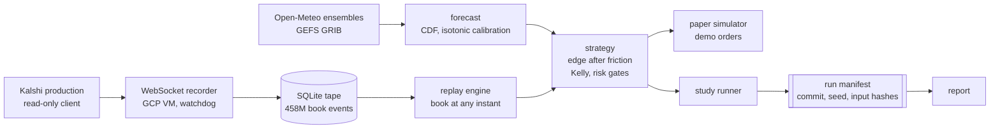

# Kalshi Weather

[](https://github.com/Eucalyptus5/kalshi-weather/actions/workflows/tests.yml)

A systematic trading system for Kalshi's daily high and low temperature markets, and the research program that measured whether it made money. It did not. Proving that to a publishable standard is what the repository is.

Four months, 337 commits, one developer. A forecast-driven trader, then the apparatus to test it: a WebSocket recorder holding 458 million order-book events, a deterministic replay engine, and five hypotheses pre-registered against a fixed alpha budget with frozen discovery and holdout splits. All five resolved. Two reached significance and neither implies a strategy.

**Stack.** Python 3.12, asyncio, SQLAlchemy and Alembic on SQLite, httpx, websockets, pydantic, NumPy, SciPy, scikit-learn, cfgrib. Deployed on GCP under systemd. Roughly 35,000 lines across 167 modules, against 4,881 tests that must be green before any commit.

> Paper and demo only. No live orders, no real capital, and no code path to a live order.

## Architecture



Studies never read the live venue. Every result below is reproducible from the recorded tape alone.

## The trader

- **Pricing.** Open-Meteo ensembles feed an `EnsembleCDF` evaluated across a market's strike ladder, so bracket probabilities sum to one across the event. Ticker parsing recovers ladder geometry from the ticker alone.
- **Calibration.** Isotonic regression refits nightly against settled outcomes, keyed on strategy, price bucket and lead time. The sizer never sees a raw model probability.
- **Entry.** Edge after friction, where the floor is the taker fee at the fill price plus a half-tick plus a piecewise adverse-selection term, rather than a flat threshold.
- **Sizing and risk.** Fractional Kelly with shrinkage on the ensemble spread. Exposure capped per market, per event, per series, as a bankroll fraction, and in aggregate.
- **Execution.** Depth-aware paper simulator, or real orders against `demo-api.kalshi.co` under `MODE=demo`. A reconciliation loop pulls official daily extremes from ACIS and books settlement against every open trade.
- **Data integrity.** Market reads run against authenticated production behind a read-only client that the order path rejects outright. Demo books carry about three percent of production's price levels, so a simulator filling against them lands at prices the venue never quoted.

## The measurement program

The trader's backtest over fifteen months of tape lost to the market's own last print in every scored cell, which turned the project into a measurement problem.

- **Recording.** WebSocket recorder on a GCP VM across 20 stations, with a stdlib-only health watchdog on a systemd timer and push alerting. Continuous since 2026-07-17, with a single seven-minute planned gap at a full host migration across cloud projects.
- **Replay.** The book at any instant, reconstructed from recorded deltas and served to unmodified strategy code. Candidate fills come from the reconstructed book, not from an assumed fill rate.
- **Provenance.** Every run writes a manifest before any statistic touches the data: git commit, dirty flag, bootstrap seed, and a SHA-256 of each input including the pre-registration itself. A missing pre-registration aborts the run. Seeds are never reused across runs that share evidence. Enforced in `bot/lag/run_manifest.py`.
- **Blind windows.** Recorder resubscribes drop roughly ten seconds of book each. Fills landing in a gap, a quiet band, or a resubscribe are excluded and reported as a share of the funnel rather than assumed away.

All prices and fees are `Decimal`, never float.

## Results

| Family | Verdict | Measured | Why it does not trade |
| --- | --- | --- | --- |
| Maker-side economics | **PASS** | +0.20c / +0.28c | Holds only while weather pays no maker fee |
| Settlement source | **PASS** | +33.5c / +39.7c | Entry instant is not identifiable in real time |
| Forecast source | **CLOSED** | -1.18c / -1.85c | Negative at full power over 15 months |
| Low-temp staleness | **UNDERPOWERED** | 5 of 30 station-days | A funded extension still projects 3x short |
| Cross-series consistency | **CLOSED** | 0 of 60 pairs | Killed on ladder geometry before any tape |
| Execution speed | **CLOSED** | 20s lag vs 79s floor | No latency advantage to build on |

Cents per contract, discovery split first and holdout second. Each family had a written pre-registration, a fixed share of a 0.05 alpha budget, and splits frozen before any tape was read. Execution speed predates the budget rather than drawing on it.

### The two passes, and why neither is a build

**Maker-side economics.** Significant on 416 discovery market-days and 152 holdout. At the published 0.0175 maker rate the same fills read negative on both splits. The venue charges no maker fee on weather today, which is a live configuration field rather than a promise, and the published fee schedule was already stale against it.

**Settlement source.** Significant on 39 discovery city event-days and 25 holdout. The official daily extreme does not exist until after the observation window closes, so nobody standing at the entry instant can know it is happening. Well defined after the fact, unactionable as measured.

Neither condition is settled by recording more tape.

### What is settled

Public weather forecasts carry no edge against the market's own last print at a 24-hour lead, measured at full power over fifteen months. No latency advantage exists at this bankroll: median reprice lag is 20 seconds against a 79-second REST sampling floor, with a quarter of events inside four seconds.

Reopening it would take a maker-fee regime change, a winter accrual window since the tape covers summer and early autumn only, or a different asset class. The recorder, replay engine and manifest machinery are not weather-specific.

## Layout

```
bot/forecast/       ensemble retrieval, calibration, CDF math
bot/markets/        ticker parsing, ladder geometry, strike math
bot/strategy/       entry rules, edge pricing, fill models
bot/risk/           sizing and exposure limits
bot/execution/      order placement against demo, paper simulator
bot/replay/         book reconstruction from recorded deltas
bot/observations/   station readings and settlement values
bot/lag/            study modules and run manifests
bot/observability/  the async loop runner behind the main scheduler
bot/backtest/       scored runs over frozen samples
bot/storage/        SQLite models and Alembic migrations
bot/validation/     input and response validation
scripts/            study runners, report generators, recorder, watchdog
```

## Setup

```
uv sync
cp .env.example .env
uv run pytest -q
```

For demo access, sign up at <https://demo.kalshi.co> and generate an API key pair. Put the key ID in `.env` as `KALSHI_DEMO_KEY_ID` and the private key PEM at `secrets/kalshi_demo.pem`, which is gitignored. Verify with `uv run python -m scripts.smoke_demo`, which prints `KXHIGHDEN` markets with their strike ladders.

GRIB decoding needs the eccodes C library, a system package: `brew install eccodes`, `apt install libeccodes-dev`, or `conda install -c conda-forge eccodes`. Tests that decode GRIB skip when it is missing.
